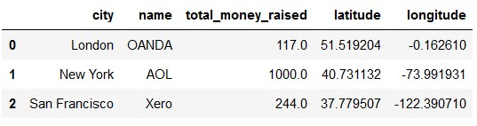

# Project 3 - Choosing the perfect headquarters for a startup

For this project, I had to use data to choose the best possible location where to place a gaming company that is entering the market now. I had some tools and criteria to guide me in my analysis.

#### Criteria to be met  

**1. The list of requirements that should be considered was the following:**
 
   
   "You recently created a new company in the GAMING industry. The company will have the following scheme:

    20 Designers
    5 UI/UX Engineers
    10 Frontend Developers
    15 Data Engineers
    5 Backend Developers
    20 Account Managers
    1 Maintenance guy that loves basketball
    10 Executives
    1 CEO/President.  
    

You have to find a place that more or less covers all the following requirements (note that it's impossible to cover all requirements, so you have to prioritize at your glance):

   - Designers like to go to design talks and share knowledge. There must be some nearby companies that also do design.

    - 30% of the company staff have at least 1 child. 

    - Developers like to be near successful tech startups that have raised at least 1 Million dollars.

    - Executives like Starbucks A LOT. Ensure there's a starbucks not too far.

    - Account managers need to travel a lot.

    - Everyone in the company is between 25 and 40, give them some place to go party.

    - The CEO is vegan.

    - If you want to make the maintenance guy happy, a basketball stadium must be around 10 Km.

    - The office dog—"Dobby" needs a hairdresser every month. Ensure there's one not too far away."

**2. With that in mind, I decided to prioritize certain aspects over others:**
* The most important thing to keep the team's morale elevated and to make them excited about the place where they are going to work, in my opinion, is having leisure options around the office. Therefore, my first chosen criteria was nightlife (bars and nightclubs), specially because all the employees are fairly young;
      

* Secondly, 30% of the employees have children, so it is primordial that parents of small children have school options around their office. Not only for the current employees, but also for future hires. Consenquently, the next criteria was the existence of elementary and nursery schools nearby the office;
      

* Thirdly, the number of account managers is expressive, so it is interesting to have at least one airport relatively close to the building;
      

* Finally, having the possibility to network with people from similar industries is something relevant, so placing the headquarters in a large city makes this aspect easier.
      

   

#### Tools used  

1. Access to a Mongo database with information from over 18,000 startups across the globe. The information varied from addresses to market value and other details. Although the data is considerably outdated (about 10 years old), it was helpful as a starting point for the project.
     

2. The second tool I used was the Foursquare API. Using it, I could map specific locations around a certain point. 
        

3. A database of airports around the world since the Foursquare API was not precise for this particular query.
        

4. The Folium library on Python to plot interactive maps for the visualizations.
       

#### The process  

The project specifications stated that I could choose (using data analysis) an existent company and "steal" their building, and that's the route I decided to take. In order to do that, I started by filtering my database to get only companies with a market value of over $10mi and that operated in the design or tech industry. The value threshold was put because successful, rich companies usually have offices in big cities with a lot of infrastructure around. After the filter and cleaning,this is the dataframe I ended up with:  

  

From there, I selected the 3 cities that had the most concentration of successful companies - New York, San Francisco and London - and the richest companies in each one - AOL, Xero and OANDA, respectively. These buildings will be my object of analysis and at the end, one of them will be selected to be "my" startup's HQ.  

Next step was extracting the information from the airport database, cleaning and filtering it so that I would have a dataframe of airports in these specific cities.  

To fulfill my other criteria, I worked with the Foursquare API and extracted the locations of the closest bars, nightclubs, elementary schools and nursery schools around each of the companies selected. At the end, I had one dataframe for each type of place in each city (nearby each company). E.g.:
     

     
I then concatenated my dataframes so I would have one for each city with all the information from different types of places and their distances from the companies.
     

The **last step** was to decide which building had the best location according to the requirements.
First thing I did was to assign a weight to each of my criteria: 0.6 to bars and nightclubs (they were the most important), 0.8 to nurseries, 0.9 to elementary schools and 1 to airports.  

Next, I took the average of the ten closest bars and nightclubs and multiplied by their weight (for this type of place, people normally like to have variety). For schools, I took the average of the two closest ones and multiplied each by their respective weight.
Finally, for aiports, I only took into consideration the closest one.
     

At the end, for each city I had a certain "score" for the category of place, just like this:

     

To decide which location was the best, I created a function that compared all the scores and counted which city had the majority of "small" ones and the result was... New York!  

Now, it was only a matter of visualizing our findings on the maps. The icons in red represent nightclubs, the ones in orange are bars, the plus signs are elementary schools and the minus ones are nurseries. The blue in the middle is the company HQ. All the airports are further away from the buildings.  

**San Francisco**:  

**London**:  

**New York**:  

#### Conclusions, final considerations and further analysis

* Although the chosen city was New York, the analysis was restricted to one building in each city, which is not the most generalist approach. It could be interesting to expand the analysis to different neighborhoods that have a high concentration of startups and/or successful companies and compare the cities based on the best neighborhood in each. We can see this clearly in the of San Francisco - the company I chose does not seem to be located in a very central place, therefore, the comparison became biased;  

* Another aspect that was not mentioned in the requirements but that could be interesting if taken into account is the continent in which the company will be placed. In Europe, workers have the advantage of being able to participate in events in many different countries, as well as networking with employees from different cultures and backgrounds. Places like the US, which are relatively isolated due to their size, do not offer this type of "flexibility";  

* Finally, it could be interesting to combine this analysis with current research on the best places to start a business and compare the results. Using a more up to date database for companies would also be helpful in order to have results that are more precise.  

